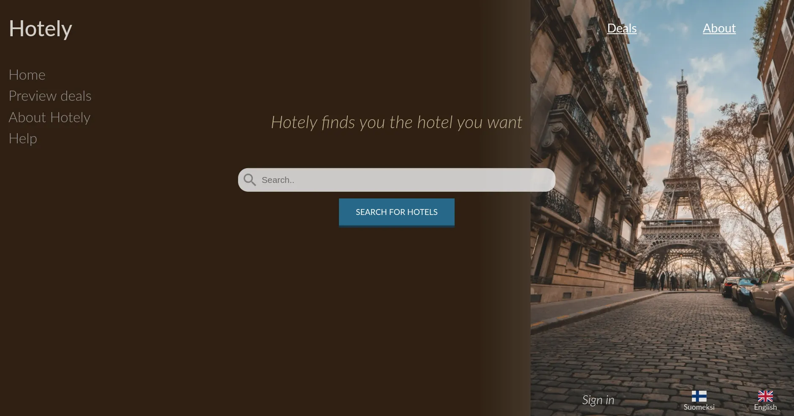

# Hotel booking demo application

Hotel booking application demo project, books hotel rooms to the clients of the hotels. Meant to act as a simple microservices deployment project. 

Configuration server segregates and centralizes the application configuration data from the services and maintains the application properties for them, acting as a centralized configuration. Configuration server uses HashiCorp Vault configuration repository to store the application properties that are sensitive. HashiCorp Vault is itself the backend for the configuration server to securely access the properties. Service Registry is implemented by Spring Cloud Eureka built in the `discovery` directory. Services register themselves to the registry, other services can obtain the location of a service instance by querying the service registry, which knows the locations of all service instances. This is further utilized by the Gateway, which does the esrvice routing, to provide a single entry point for all the services. It implements API Gateway pattern, all teh traffic routes through API Gateway and the gateway will route the requests to the appropriate services. Redhat Keycloak acts as an STS/Authorization server for the gateway and the client, handling user authenticatino and authorization. Persistence is handled through Apache Cassandra, which deploys two nodes by default. Comes with built-in cluster, eventual consistency and linear write scalability, making it decent fit for the service oriented structure of project, although the deployment model itself is contrived for the sake of learning.

The services themselves are implemented in the customer-service and hotel-service directories, both which interface with Apache Cassandra instances. Hotel-service is the handles giving out the hotels, cities, bookings and rooms for the client and customer-service handles user data like keeping user data and invoices.

# How do I run this application?

1. `$ make initialize`, initializes necessary volumes, networks and secrets.
2. `$ make casmaster caspair hcpvault keycloak`, deploys cassandra instances, HCP Vault and Redhat Keycloak (all the "external" applications).
3. `$ make cfg discovery`, builds and deploys the configuration server and discovery.
4. `$ make services`, builds and deploys all the services being used by the client.
5. `$ make gateway`, builds and deploys the Gateway, reserved as the second last operation so it access all the services immediately.
6. `$ make client`, builds and deploys the client, reserved as the last operation so it access the gateway, although this is not strictly necessary until request to services are made.

# HashiCorp Vault

Vault can be deployed and initialized with data from commandline arguments and vault/vault directory by running: `$ make hcpvault`.

Vault can also be optionally deployed using docker-compose with `$ sh vault/startup.sh -c -i --root ${PWD}`

The sensitive data is in the `vault/vault/data` directory, where you can store data to. `vault/vault` directory also contains configuration for the vault and policies.

NOTE: `$ make hcpvault` uses predefined arguments to run the vault/startup.sh script, you can change these arguments in the Makefile yourself if you wish or just run the script yourself with arguments `$ sh vault/startup.sh --help` for more.

# Redhat Keycloak

Keycloak can be deployed and initialized with: `$ make keycloak`. 
This deployes and initializes vault with predefined arguments in the make recipe.

You can change these arguments to your liking by changing the Makefile or just using the script yourself: `$ sh keycloak/startup.sh --help`.

# Apache Cassandra

You can deploy cassandra instance using `$ make casmaster`.
This deploys and initializes Apache Cassandra instance with predefined scheme and data for the hotelapp application. Note that the cassandra/startup.sh is merely for initialization and the actual deployment is done by a make recipe -> `make master` or `make pair`

You can change these arguments to your liking by changing the Makefile or just using the script yourself: `$ sh casssandra/startup.sh --help`.

# Structure of the application

Gateway guards the microservices and uses Keycloak as the STS into the application.

If you try to deploy this app with: `$ docker stack deploy --compose-file docker-compose.yml multi-tier-app`, you will most likely be greeted by "secret not found error". Swarm requires that all cluster-level resources that a service depends on exist prior to proceeding with the deployment. So Docker halted the application deployment when it determined a resource dependency was missing.

The missing cluster-level resource that this application depends on is the POSTGRES\_PASSWORD secret. Recall that the application’s reference to that secret said that it was defined externally, if you look at the compose file `secrets` property. In this context, external means defined outside the application deployment definition and provided by Swarm.

To view secrets you can use `$ docker secret ls`

**Note! Directory names are used by the deployment and build scripts to a significant enough extent, so that changing names of them may break functionality of some of the scripts.**

# Ports configuration

* Apache Cassandra instaces 9042, 9043 7000
* HashiCorp Vault 8200
* Redhat Keycloak/Authorization server/STS 8080

* Configuration server 8888
* Service Discovery 8761
* Gateway API 8072

* Client 8081
* Customer-service 8000
* Hotel-service 8001
